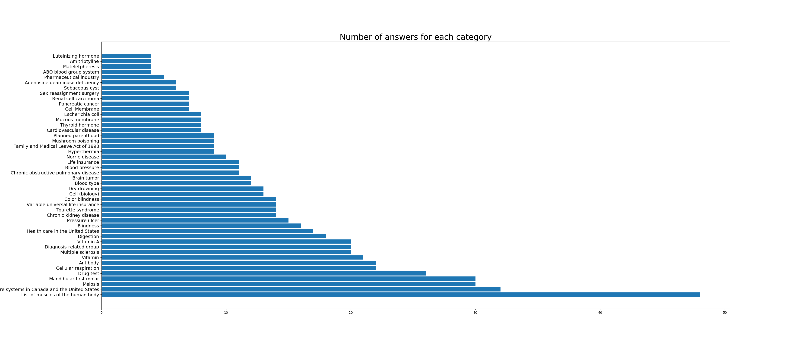

# Exploration of Zipf's Law on the WikiQA Corpus Through Data Visualization

# Jarid Siewierski

## The Dataset
For this project I decided to use the WikiQA Corpus. Released in 2016 the dataset was published by Microsoft for public research on open-domain question answering. The dataset is comprised of annotated Bing queries with each question linked to a Wikipedia article with the potential answer, pulling sentences from the summary section since that usually has the most important information. Having prior experience building simple chatbots off an ALICE input/output format I figured this would be an interesting dataset to explore to see what compromises answers to certain questions.


## Project Goals
- Enhance my Data Visualization skills
- Pracice cleaning text data for NLP projects
- Explore if Zipf's Law stands as we narrow down the corpa

## Cleaning 
With the dataset containing 3044 different questions and 2809 different categories I had to decide how to narrow down the dataset. I handpicked roughly 50 categories loosely relating to healtcare to look at. This smaller dataset had roughly 570 rows with plenty of text to sift through. Using the WordCloud library I was able to produce the following word clouds on both the entire dataset and my subset, both with no stopwords.

 


Even after having narrowed down the dataset I was curious about what were common patterns with answers in specific categories so I had to get more granular and do some more cleaning. To choose which categories to look at I decided to plot out which categories would have the most data to work with. I made the following graph to help me do this.



Looking at the above graph you can see that the 6 categories with the most answers were:
- List of muscles of the human body
- Comparison of the health care systems in Canada and the United States
- Meiosis
- Mandibular first molar
- Antibody
- Cellular respiration

Getting the dataframe of these categories was straight forward and simply required me to do a filter by masking selecting only rows that matched the specific category and concatenating those series together back into one dataframe.

## Getting the Word Count
As is the case with most NLP projects getting the word count was my main goal for this EDA. I ended up doing this all in pandas rather than using an external library which most people use for machinelearning projects. These were the steps that I took to get the word count for each category in my previously made dataframe.
1. Convert the column that contained a string of the sentence answer into a list of seperate words. (Using a regex in split helped)
2. Parse each word in that list into it's own row but grouping it by category
3. Used the NLTK corpa to filter out stop words
4. Remove any empty rows left in the words column from parsing
5. Count the word occurrence and put it in a new column named 'n_w' and return the dataframe.

Here is the pipeline function for the above steps:
```python
def count_words_pipeline(df, remove_stop=False):
    df = create_words_col(df)
    words_df = parse_words_to_word(df)
    if remove_stop:
        words_df = remove_stop_words(words_df)
    words_df = remove_empty_word_cols(words_df)
    return count_word_ocurrence(words_df)
```

