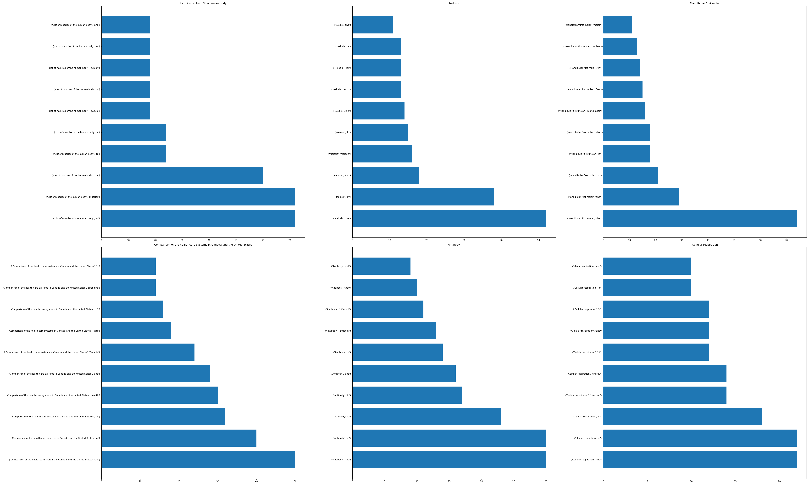
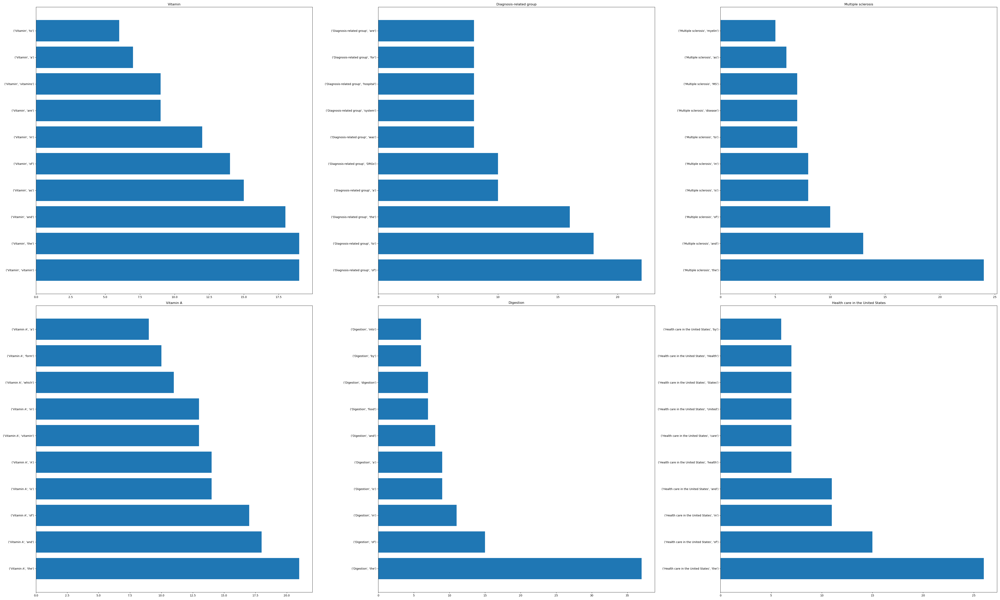
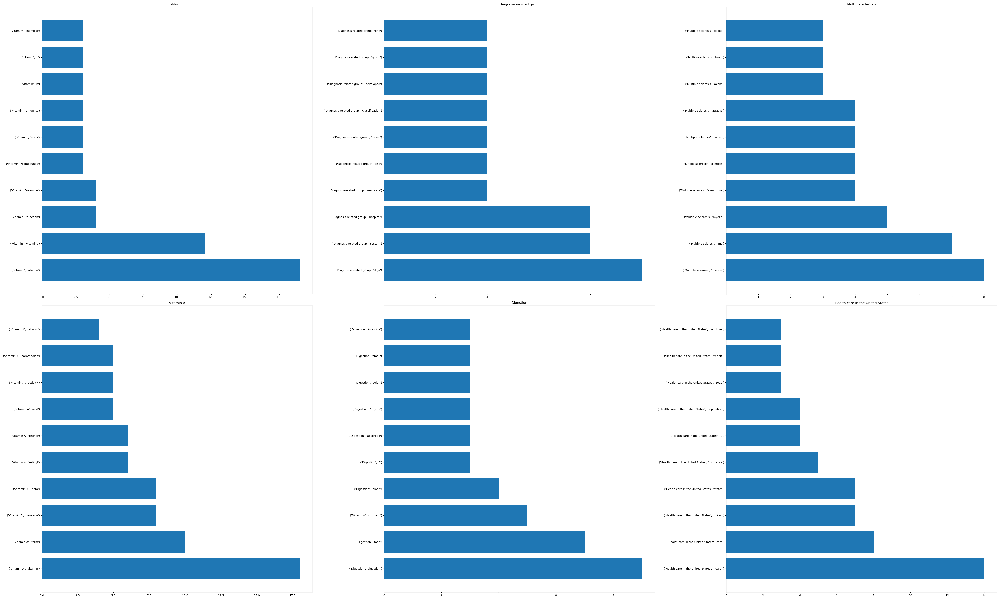
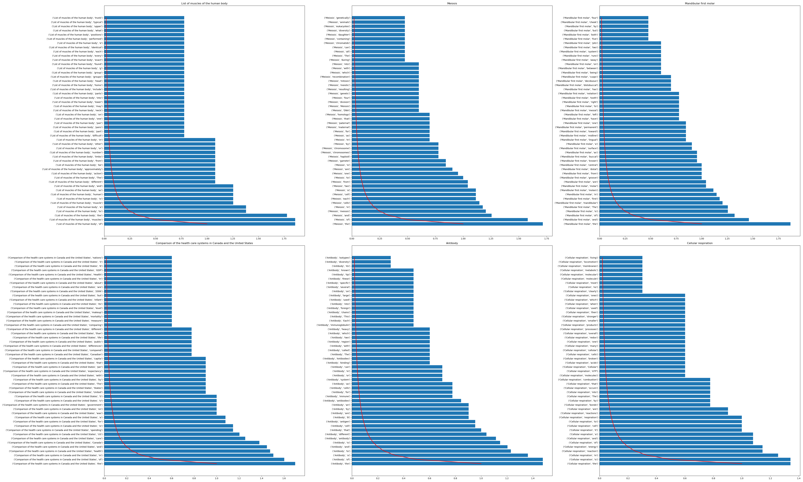
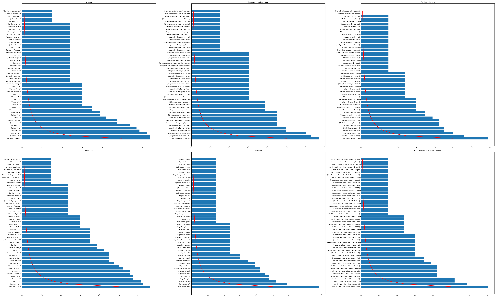
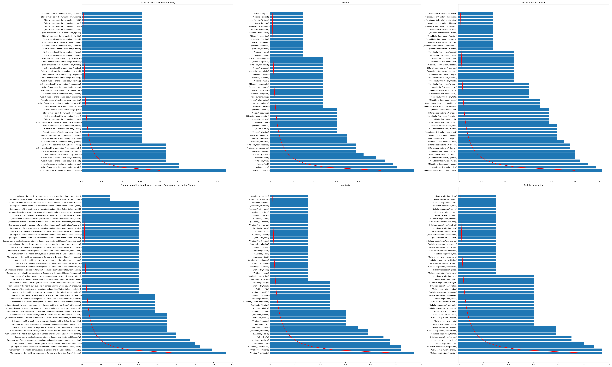
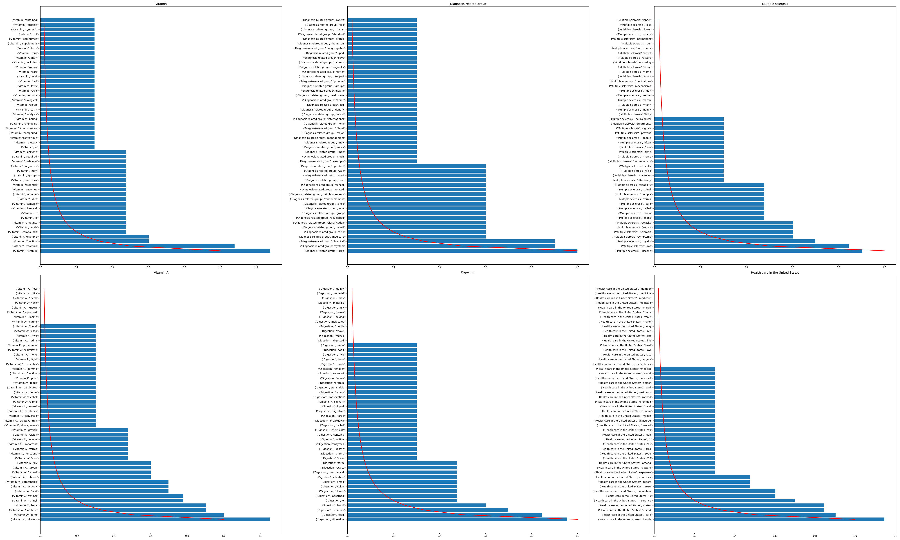
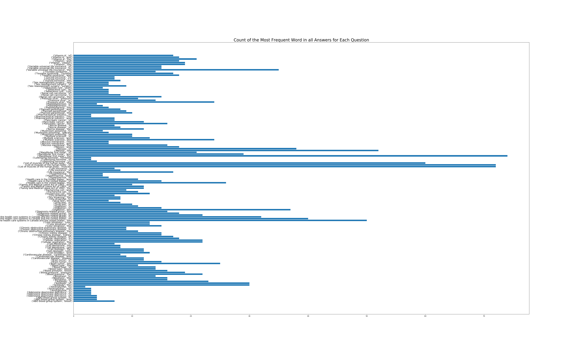
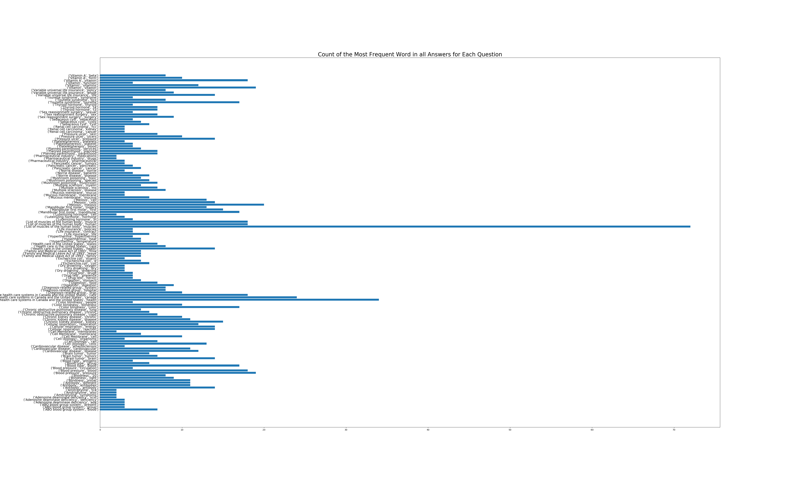

# Exploration of the WikiQA Corpus: Data Visualization and Zipf's Law

# Jarid Siewierski

## The Dataset
For this project I decided to use the WikiQA Corpus. Released in 2016 the dataset was published by Microsoft for public research on open-domain question answering. The dataset is comprised of annotated Bing queries with each question linked to a Wikipedia article with the potential answer, pulling sentences from the summary section since that usually has the most important information. Having prior experience building simple chatbots off an ALICE input/output format I figured this would be an interesting dataset to explore to see what compromises answers to certain questions.


## Project Goals
- Enhance my Data Visualization skills
- Pracice cleaning text data for NLP projects
- Explore if Zipf's Law stands as we narrow down the corpa

## Cleaning 
With the dataset containing 3044 different questions and 2809 different categories I had to decide how to narrow down the dataset. I handpicked roughly 50 categories loosely relating to healtcare to look at. This smaller dataset had roughly 570 rows with plenty of text to sift through. Using the WordCloud library I was able to produce the following word clouds on both the entire dataset and my subset, both with no stopwords.

 


Even after having narrowed down the dataset I was curious about what were common patterns with answers in specific categories so I had to get more granular and do some more cleaning. To choose which categories to look at I decided to plot out which categories would have the most data to work with. I made the following graph to help me do this.


Looking at the above graph you can see that the 6 categories with the most answers were:
- List of muscles of the human body
- Comparison of the health care systems in Canada and the United States
- Meiosis
- Mandibular first molar
- Antibody
- Cellular respiration

Getting the dataframe of these categories was straight forward and simply required me to do a filter by masking selecting only rows that matched the specific category and concatenating those series together back into one dataframe.

## Getting the Word Count
As is the case with most NLP projects getting the word count was my main goal for this EDA. I ended up doing this all in pandas rather than using an external library which most people use for machinelearning projects. These were the steps that I took to get the word count for each category in my previously made dataframe.
1. Convert the column that contained a string of the sentence answer into a list of seperate words. (Using a regex in split helped)
2. Parse each word in that list into it's own row but grouping it by category
3. Used the NLTK corpa to filter out stop words
4. Remove any empty rows left in the words column from parsing
5. Count the word occurrence and put it in a new column named 'n_w' and return the dataframe.

Here is the pipeline function for the above steps:
```python
def count_words_pipeline(df, remove_stop=False):
    df = create_words_col(df)
    words_df = parse_words_to_word(df)
    if remove_stop:
        words_df = remove_stop_words(words_df)
    words_df = remove_empty_word_cols(words_df)
    return count_word_ocurrence(words_df)
```
This was the resulting dataframe that the above function returned:


With this dataframe I was able to run it through a pipeline I had created to create bar charts displaying the top 10 words with the highest word count and violin plots of the distribution of word counts for each category.
Most of the violin charts didn't provide much insight and looked similar to this one:

 

But here are 2 of my favorites...

### Diagnosis-related with no stop words:


### List of muscles of the human body with stop words


Here are the bar charts of the 6 categories...

### With Stop Words Included



### With Stop Words Removed


For extra data collection I ran the next 6 categories with the highest amount of answers through the plotting pipeline and produced the following graphs...

### With Stop Words Included



### With Stop Words Removed



## An Interesting Trend...Zipf's Law
While plotting these graphs an interesting trend kept occurring regardless if stop words were included or not. This trend is known as Zipf's Law.

### Zipf's Law
From Wikipedia:
> Zipf's law is an empirical law formulated using mathematical statistics that refers to the fact that many types of data studied in the physical and social sciences can be approximated with a Zipfian distribution, one of a family of related discrete power law probability distributions. Zipf distribution is related to the zeta distribution, but is not identical... Thus the most frequent word will occur approximately twice as often as the second most frequent word, three times as often as the third most frequent word, etc.: the rank-frequency distribution is an inverse relation. For example, in the Brown Corpus of American English text, the word the is the most frequently occurring word, and by itself accounts for nearly 7% of all word occurrences (69,971 out of slightly over 1 million). True to Zipf's Law, the second-place word of accounts for slightly over 3.5% of words (36,411 occurrences), followed by and (28,852).


To investigate this further I took the log10 of the word counts, this time of the top 50 words, and overlayed it with the zipf's distribution to see how it matched up. The results weren't disapointing. 

### With Stop Words Included




### With Stop Words Removed




Even when we zoom out and look at the whole dataset that I had picked out we see the zipf's distribution coming into even by just looking at the top 3 most frequent words.



## Conclusion

While the top of the distribution, where the word count is the highest, the overall trend did occurr throughout the entirety of the distribution. It was also notable that the distribution seemed to be unaffected by the inclusion of stop words showing the true universality of the distribution. Potential reasons for why some of the word counts were a little top heavy was due to the fact that they were grouped by a certain category, increasing the likely hood that the same words would show up multiple times. Taking this into account it's important to remember that zipf's law is emergent and that it can not be proven by theory for when it shows up. At least not yet.